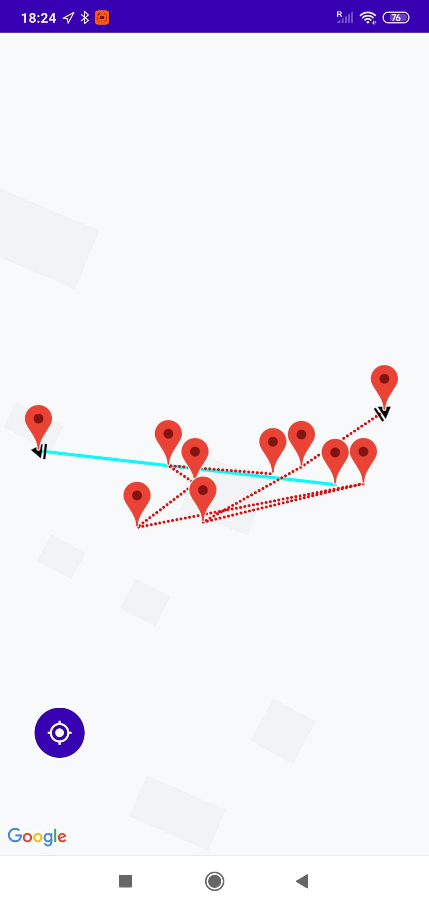

# MovementTracker

ANDROID APP FOR PURPOSE OF MODELING PEOPLE MOVEMENT.

The purpose of this mobile app is to track human movment, validate GPS samples
and store it in Firebase. Collected samples, which create full paths can be ploted on separate view.
The App may run in the background as well as in the foreground. App displays currently tracked path
on the main view.
Application is constructed in such way that multiple users can simultaneously record their positions 
and store them in cloud database.

App require minumum android oreo (7) since it is being developed in Java 8.

<h2>Overview</h2>

  <h3> main activity</h3>
  
   
   <h3>side menu</h3>

   
  <h3>select one or multiple track</h3>

   
  <h3>View to display chosen tracks</h3>

Still IN DEVELOPMENT....
